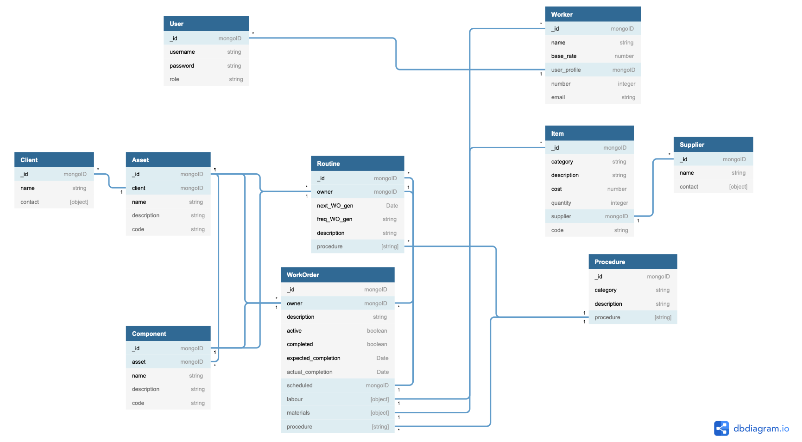

# PAMM: A Plant/Asset Maintenance Manager

PAMM is a web based application designed to incorporate the functionality of traditional maintenance management software. In my personal experience, software such as this can be quite outdated and legacy based. This leads to useage issues both remotely and on newer systems. I have also found the overall structure of maintanence management software can be convoluted and unintuitive. This app aims to address these issues and create an accessible and simple solution for industrial maintenance management.

A working deployment of the app can be viewed [here](https://pamm.herokuapp.com/).

## Using the App
For local installation:
* Pull a clone of the repository and open the base directory in a terminal
* npm run build
* npm run start
* the app will now be accessible on http://localhost:4000
* username: admin, password: password is the default access

The landing page of the app is essentially the dashboard of the app (further functionality of the schedule is intended to be implemented) which links to successive screens. The heart of the app lies in the reports menu, where work orders can be generated, viewed and managed. In order to generate work orders, assets and subsequent routines for individual clients must be defined via the clients menu. Detailed instructions for using the app can be viewed [here](documentation/README.md).

## Technologies and Approach Taken

The app is built upon a custom scripted Node.js backend utilising an Express server with a MongoDB database. As numerous models were utilised in the structure of the app, backend routes have been compartmentalised into common endpoints for all models (i.e. CRUD). The basic structure of the backend can be seen in the models and relationships defined below:

This formed the foundation of the app which was then built upon. For the user interface, React is used in conjuction with Material-UI. React-router-DOM is used to control the flow of the screens and allow plain linking to seperate components of the app. Overall the app is intended to provide a single page self-contained application feel. Additional libraries utilised are detailed below:

### Frontend
* FullCalendar - for weekly schedule that appears on the app homepage
* react-pdf - generating and rendering PDF copies of work order records
* material-table - editable and searchable tables within the app

### Backend 
* mongoose - MongoDB object modelling and control
* express-session, connect-mongo & bcrypt - authorisation, session storing and encryption

## For the Future
* Stability fixes for the PDF rendering functionality, currently this can cause the app to hang and crash due to race conditions occurring in the third-party PDF renderer. The current workaround of implementing a setTimeout on the render is rather hacky/unstable.
* Settings menu expanded (currently under construction) to include automatic generation of work orders upon login given a defined period.
* Greater functionality of schedule on landing screen (i.e. include direct linking to work orders appearing in the schedule).
* Displaying of work order stats etc. for saved work orders (work order summary screen under construction).
* Proper inventory control through linking of work orders and items (inventory).
* Implement mass generation/printing/deletion of work orders for given parameters.
* Codebase, particularly on the client side, needs refactoring and reorganising as some components are too large/messy
* Improved/ dynamic rendering for different screen sizes
* In addition, a simplified app is presented for mobile devices (or similar screen sizes).

